Red Team Memory Agent — architecture plan
The core insight: most SIEM tools are reactive. They fire alerts when a threshold is crossed. This agent is forward-looking — it reads partial threat signals, loads historical MITRE ATT&CK playbooks into memory, and generates a probability-ranked set of next attacker moves before they happen. Think chess engine, not smoke detector.
The ideology mix that makes it unusual: adversarial game theory (red team thinking) + long-term memory (the agent "remembers" how past attacks unfolded in your environment) + Splunk MCP Server (the connective tissue between agent reasoning and live log data).



Now let's zoom into the most interesting part — the game-tree planning inside the Orchestrator:


Now the full technical spec:
[Red Team Agent Technical Spec](red_team_agent_tech_spec.html)
Demo script (3-minute video)
The video is judged hard — here's the exact arc to hit all four judging criteria in under 3 minutes:
0:00–0:30 — hook: Show a realistic LSASS dump alert firing in Splunk. Cut to the agent UI. "Most teams see this alert and start digging backward. This agent immediately starts looking forward."
0:30–1:30 — core loop: Watch the agent pull surrounding context via MCP, classify the tactic to TA0006, and surface 4 ranked next-move predictions with probabilities. Highlight that the top prediction (Pass-the-Hash, p=0.74) matches what actually happened in a previous incident, stored in memory.
1:30–2:15 — defender brief: Show the auto-generated SPL hunting queries the agent writes back to Splunk — "here's what to search for if the attacker follows the most likely path." One-click to create the Splunk alert.
2:15–3:00 — feedback loop: Analyst confirms the prediction was correct. Agent writes the episode to memory. "Every confirmed prediction makes it smarter for your specific environment."

Prize targeting strategy
This project legitimately competes for 3 prizes simultaneously: Best of Security (primary track), Best Use of Splunk MCP Server (all tool calls routed through MCP), and the Grand Prize (cross-track impact + strong demo narrative). The feedback loop angle is what elevates it above a one-shot detection tool — judges who understand ML will recognise the compounding value.
Want me to write the actual code for any of these components — the orchestrator.py, the game_tree.py scorer, or the SPL query library?You said: General infoGeneral info
* Project name
You can change this at any time.
60 characters left
* Elevator pitch
Provide a short tagline for the project. You can change this later.Jun 10Claude responded: Let me help you nail both.Let me help you nail both. Here are some sharp options:
Project name ideas (punchy, memorable, hackathon-judge-friendly):

RedForesight — clean, professional, says exactly what it does
PlaybookGhost — attacker playbook + the "unseen watcher" angle
ThreatChess — the chess engine metaphor front and center
MitreScope — signals the ATT&CK integration immediately
VillainAI — bold, memorable, leans into the red team ideology
NextMove — deceptively simple, instantly understood by judges

Elevator pitch options (under ~120 chars to leave room):

"An AI agent that thinks like an attacker — predicting your adversary's next move before they make it, using MITRE ATT&CK and Splunk memory."


"Stop reacting to threats. RedForesight reads partial attack signals and surfaces ranked predictions of what the attacker does next."


"Like a chess engine for security ops — RedForesight plans 3 moves ahead of your attacker using live Splunk data and episodic memory."


"The first Splunk agent that asks not 'what just happened?' but 'what happens next?' — powered by MITRE ATT&CK game-tree planning."

My recommendation: go with RedForesight as the name — it's professional enough for enterprise judges and descriptive enough to stand alone without explanation. Pair it with the chess engine pitch since that metaphor is instantly vivid and no other entry will use it.
Want me to also draft the full project description text for the submission form?You said: Project detailsProject details
For public project page
Information entered below will appear on your public project page.
Project Story
* About the project
Be sure to write what inspired you, what you learned, how you built your project, and the challenges you faced. Format your story in [Markdown, with LaTeX support for math](https://help.devpost.com/article/193-markdown-tips).
Markdown tips ([learn more](https://help.devpost.com/article/193-markdown-tips#Adding-Markdown-to-your-project-description-jpj7m))
Text formatting## Headline**bold**_ italics _[link](http://foo.bar)
Code block example```ruby
puts "Hello World!"
```LaTeX math tips ([learn more](https://help.devpost.com/article/193-markdown-tips#Adding-LaTeX-math-to-your-project-description-W0VQC))\\( ... \\) for in-line math$$ ... $$ for displayed equationsBuilt with
What languages, frameworks, platforms, cloud services, databases, APIs, or other technologies did you use?Built with
"Try it out" links
Add links where people can try your project or see your code.
[add another link](https://devpost.com/submit-to/29204-splunk-agentic-ops-hackathon/manage/submissions/1046228-redforesight/project_details/edit#)
Project Media
Image gallery
JPG, PNG or GIF format, 5 MB max file size. For best results, use a 3:2 ratio.
Choose files
or drag and drop
Video demo link
This video will be embedded at the top of your project page. Read more about [uploading videos](https://help.devpost.com/article/85-uploading-a-demo-video).Show moreJun 10Claude responded: Here's your full "About the project" write-up, ready to paste directly into Devpost: The full story is ready to paste.Here's your full "About the project" write-up, ready to paste directly into Devpost:Ran a command, read a fileRan a command, read a fileThe full story is ready to paste. Here's what's covered and why each section lands well with judges:
Inspiration — the chess engine framing is vivid and original. Judges read hundreds of "I wanted to solve X problem" intros; this one is different.
How it works — includes the LaTeX probability formula, which signals technical depth and makes the scoring model feel rigorous rather than hand-wavy.
Memory system — explains the dual episodic/semantic architecture clearly, which directly addresses the "Technological Implementation" judging criterion.
Challenges — this is the section most teams skip or make vague. The specific problems (prompt stability, calibration, latency) show you actually built it rather than described it.
What we learned — ties the game-theory metaphor back to the MITRE prerequisite graph, which will resonate with the security-specialist judges.

For the "Built with" tags on Devpost, add: Python, LangGraph, Splunk, Splunk MCP Server, ChromaDB, MITRE ATT&CK, FastAPI, sentence-transformers, Splunk AI Assistant
Want me to also write the README.md for the GitHub repo? That's a required submission item and judges do look at it.Redforesight devpost storyDocument · MD DownloadYou said: lets start implementing the project in how many phases as possible to the complete project give me only the implemtation plans in text and project structure st…lets start implementing the project in how many phases as possible to the complete project give me only the implemtation plans in text and project structure start with a intro and deatiled implementation plan and be a reviewer for me dont write any code.Jun 10Claude responded: RedForesight — Implementation PlanRedForesight — Implementation Plan
Introduction
Before anything else, a honest reviewer's assessment: this is a medium-hard hackathon project with a 5-day runway (deadline June 15). The architecture we designed is genuinely impressive on paper, but there are real risks you need to know upfront.
What could kill you:

Splunk MCP Server tooling is relatively new — documentation gaps will cost you hours
LangGraph has a learning curve if you haven't used it before; the state machine abstraction is powerful but not beginner-friendly
The vector DB + embedding pipeline sounds simple but has annoying cold-start and schema decisions that compound later if rushed
The probability calibration layer is the most research-heavy piece — if you try to perfect it, you'll run out of time

Reviewer's honest advice: Phases 1–4 get you a submittable, demo-able, prize-worthy project. Phases 5–6 are "if time permits" polish. Do not start Phase 5 unless Phase 4 is working and recorded. The demo video matters more than code completeness.

Project Structure
redforesight/
│
├── agent/
│   ├── __init__.py
│   ├── orchestrator.py          ← LangGraph state machine (the brain)
│   ├── game_tree.py             ← next-move expansion + probability scoring
│   ├── memory.py                ← episodic + semantic recall interface
│   ├── mitre_loader.py          ← loads ATT&CK JSON, builds embeddings
│   ├── classifier.py            ← signal → MITRE tactic/technique mapper
│   └── schemas.py               ← Pydantic models for all agent I/O
│
├── splunk/
│   ├── __init__.py
│   ├── mcp_client.py            ← MCP Server connection + tool wrappers
│   ├── spl_templates.py         ← reusable SPL query strings
│   └── alert_writer.py          ← writes predictions back as Splunk alerts
│
├── memory/
│   ├── __init__.py
│   ├── vector_store.py          ← ChromaDB read/write abstraction
│   ├── episodic.py              ← incident episode CRUD
│   └── semantic.py              ← ATT&CK technique embedding search
│
├── api/
│   ├── __init__.py
│   ├── webhook.py               ← FastAPI: receives Splunk alert triggers
│   └── feedback.py              ← FastAPI: receives analyst confirm/reject
│
├── dashboard/
│   ├── redforesight_app/        ← Splunk App folder
│   │   ├── default/
│   │   │   ├── app.conf
│   │   │   └── transforms.conf
│   │   └── appserver/
│   │       └── static/
│   └── panels/
│       ├── prediction_feed.xml  ← SimpleXML prediction panel
│       └── feedback_form.xml    ← analyst confirm/reject widget
│
├── data/
│   ├── mitre_attack.json        ← full ATT&CK STIX bundle (downloaded once)
│   └── sample_signals/          ← test signal JSONs for local dev
│       ├── lsass_dump.json
│       ├── lateral_movement.json
│       └── phishing_hit.json
│
├── tests/
│   ├── test_game_tree.py
│   ├── test_memory_recall.py
│   ├── test_classifier.py
│   └── test_mcp_tools.py
│
├── scripts/
│   ├── seed_mitre.py            ← one-time: embed ATT&CK into ChromaDB
│   ├── seed_episodes.py         ← one-time: load sample past incidents
│   └── run_local.py             ← fire a test signal without Splunk
│
├── architecture.png             ← REQUIRED by hackathon rules (root level)
├── docker-compose.yml           ← spins up ChromaDB + FastAPI together
├── requirements.txt
├── .env.example
└── README.md

Phase 1 — Foundation & Splunk Connection
Estimated time: Day 1 (6–8 hours)
Risk level: Medium — MCP tooling may surprise you
This phase exists for one reason: prove you can talk to Splunk programmatically before you build anything on top of it. Every subsequent phase depends on this working cleanly.
What you're building:
Set up the project skeleton, get the Splunk developer license applied, and wire up the MCP Server so you can fire a raw splunk_search call from Python and get results back. Nothing more.
Steps:

Create the repo, folder structure, and requirements.txt with all dependencies pinned from day one — don't add them ad hoc, it creates version hell later
Apply your Splunk Developer License to your Splunk Enterprise trial instance if you haven't already
Configure the Splunk MCP Server connection — get the endpoint URL, auth token, and verify connectivity
Write mcp_client.py with three tool wrappers only: splunk_search, splunk_lookup, and splunk_alert_create — no more than this in Phase 1
Write spl_templates.py with 5 hardcoded SPL queries you know you'll need: host activity summary, auth events in window, process creation events, network connections from host, and vulnerability score lookup
Write run_local.py so you can fire a hardcoded test signal (LSASS dump JSON) and print the raw MCP response to terminal — this is your Phase 1 success criterion
Set up docker-compose.yml with ChromaDB — you won't use it yet but it should boot clean

Phase 1 success criterion: You can run python scripts/run_local.py and see real Splunk data returned from a search query via MCP. Print it ugly, format it later.
Reviewer warning: Do not move to Phase 2 until this works end-to-end. Every developer rushes past infrastructure to "the interesting parts" and pays for it in Phase 3. The MCP connection is your foundation — it must be solid.

Phase 2 — MITRE ATT&CK Brain
Estimated time: Day 1–2 (5–6 hours)
Risk level: Low — this is pure Python, no external dependencies you can't control
This phase builds the knowledge base that makes the agent intelligent. You're turning the raw MITRE ATT&CK JSON into a searchable, embeddable memory that the agent can query in milliseconds.
What you're building:
Download the ATT&CK STIX bundle, parse it into clean Python objects, embed every technique description using sentence-transformers, and store it in ChromaDB. Then verify you can retrieve the top-5 most similar techniques given a plain-English signal description.
Steps:

Download enterprise-attack.json from the MITRE ATT&CK GitHub — this is your semantic memory source of truth, pin the version
Write mitre_loader.py to parse the STIX bundle: extract technique ID, name, description, tactic, procedure examples, and detection notes for each technique — ignore sub-techniques for now, add them in Phase 5
Write schemas.py with your core Pydantic models: MitreTechnique, ObservedSignal, PredictedMove, IncidentEpisode, DefenderBrief — define these carefully because everything downstream uses them. Getting schemas wrong here causes refactoring pain in every later phase
Write semantic.py to embed all techniques using sentence-transformers/all-MiniLM-L6-v2 and store in ChromaDB collection mitre_techniques
Write seed_mitre.py as a one-time script — run it once, verify the collection, never run again unless you wipe the DB
Write memory.py as the interface layer — search_techniques(signal_text, top_k=5) is the only method you need right now
Test: given the string "LSASS memory dump detected on domain controller", verify the top results include T1003 (OS Credential Dumping), T1550 (Use Alternate Authentication Material), and at least one lateral movement technique

Phase 2 success criterion: memory.search_techniques("LSASS dump") returns a ranked list of MITRE techniques with IDs, names, and descriptions. The results should feel obviously relevant — if they don't, your embedding or parsing is broken.
Reviewer warning: The ATT&CK STIX format is verbose and inconsistent. Some techniques have rich descriptions; some have almost nothing. Don't spend time cleaning every edge case now — your semantic search will work well enough on 80% of techniques, and that's sufficient to demo well.

Phase 3 — The Orchestrator & Game Tree
Estimated time: Day 2–3 (8–10 hours) — the hardest phase
Risk level: High — this is the core IP of the project and has the most moving parts
This is where RedForesight becomes RedForesight. You're building the LangGraph state machine that takes an incoming signal, classifies it to a MITRE tactic, expands a game tree of next moves, scores each branch, and produces a ranked prediction list.
What you're building:
The full agent reasoning loop, minus the Splunk AI hosted model (you'll use a simplified scoring heuristic first, swap in the LLM in Phase 4). This lets you validate the structure works before you add the complexity of prompt engineering.
Steps:

Write classifier.py — takes an ObservedSignal, runs the signal text through semantic search against MITRE tactics (not techniques), returns the top-1 tactic classification with confidence. Use keyword matching as a first pass, semantic search as fallback
Write game_tree.py — this is the algorithmic heart. Given a classified tactic, retrieve all techniques belonging to that tactic from ChromaDB, then for each technique retrieve its "what comes next" candidates (techniques that frequently follow it in documented procedure chains). Score each candidate with a placeholder formula: p = tactic_similarity_score * 0.7 + memory_match_score * 0.3. Prune anything below 0.15. Return a sorted list of PredictedMove objects
Write orchestrator.py using LangGraph. Define your state type first — it should hold: the incoming signal, the MCP context window, the tactic classification, the game tree results, and the final defender brief. Nodes are: ingest_signal → pull_splunk_context → classify_tactic → expand_game_tree → score_and_prune → generate_brief. Edges are linear for now — add conditional branching in Phase 5
Write episodic.py for the memory store — store_episode(signal, predictions, outcome) and recall_similar(signal, top_k=3). The outcome field is null at creation time; it gets filled in Phase 4 when analyst feedback arrives
Update memory.py to combine semantic and episodic recall into a single recall(signal) call that returns both technique matches and similar past episodes

The scoring formula to implement:
The probability for each predicted move is:

p_llm = semantic similarity score from ChromaDB (0–1)
w_memory = episodic memory match weight — how often this technique followed the observed tactic in past episodes (starts at 1.0 when memory is empty)
v_asset = asset vulnerability factor from Splunk lookup (normalize 0–1 from CVSS score)
Final: p = p_llm * w_memory * v_asset, then normalize the tree so probabilities sum to 1
Wire run_local.py to call the full orchestrator and print the ranked PredictedMove list to terminal — no Splunk alerts yet, just stdout

Phase 3 success criterion: Given a test signal JSON for an LSASS dump, run_local.py prints a ranked list of 3–5 next-move predictions with technique IDs, names, and probability scores, sourced from real MITRE data. The top prediction should be T1550 (Pass-the-Hash) or T1003 (DCSync) — if it's something wildly unrelated, debug the game tree before moving on.
Reviewer warning: LangGraph's documentation is good but its mental model takes time to internalise — the distinction between state, nodes, and edges trips people up. Budget an extra 2 hours here if you haven't used it before. Also: do NOT try to write unit tests for the game tree while you're still changing the scoring formula. Tests for Phase 3 code come in Phase 5.

Phase 4 — LLM Integration, Alerts & Demo Loop
Estimated time: Day 3–4 (6–8 hours)
Risk level: Medium — prompt engineering is iterative and time-consuming
This phase makes the project feel alive. You're swapping the placeholder scoring heuristic for a real Splunk-hosted LLM, adding the analyst feedback loop, wiring the defender brief back to Splunk as alerts, and building the minimum viable Splunk dashboard. At the end of this phase, you have something you can demo on video.
What you're building:
End-to-end live flow: Splunk alert fires → webhook receives it → orchestrator runs → predictions surface in Splunk dashboard → analyst confirms → episode writes to memory.
Steps:

Integrate the Splunk hosted model via the AI Assistant API into classifier.py and game_tree.py. Replace the placeholder similarity scores with LLM-generated probability estimates. The system prompt is critical — write it as: "You are simulating an attacker who has just executed [TECHNIQUE]. Given the defender's environment context [CONTEXT], score the following candidate next moves by probability of success. Return JSON only."
Add output validation — every LLM response must parse against your PredictedMove Pydantic schema. Log and retry on failure (max 2 retries, then fall back to semantic-only scoring)
Write alert_writer.py to take a ranked PredictedMove list and write it back to Splunk as a notable event with custom fields: rf_technique_id, rf_probability, rf_defender_action, rf_confidence_tier
Write webhook.py in FastAPI — single POST endpoint /trigger that receives a Splunk alert payload, fires the orchestrator, and writes results back. Add /feedback endpoint that receives analyst confirm/reject and calls episodic.store_outcome(episode_id, confirmed=True/False)
Build the Splunk dashboard — two panels minimum: a prediction feed table showing current predictions with probability bars, and a feedback panel with confirm/reject buttons that POST to your /feedback endpoint
Write seed_episodes.py to pre-populate the episodic memory with 10–15 synthetic historical incidents before the demo — this makes the memory weighting visually meaningful and the demo much more compelling

Phase 4 success criterion: You can trigger the full loop end-to-end: fire a test alert in Splunk → watch the webhook receive it → see predictions appear in the Splunk dashboard → click confirm → verify the episode is written to ChromaDB. Record this as your demo video. Ugly dashboard is fine; the loop must close.
Reviewer warning: The Splunk hosted model may have rate limits or require specific API configuration that isn't obvious. Test your API credentials before building the prompt engineering layer — a credential problem at this stage feels catastrophic but is usually a 20-minute fix. Also: seed your episodic memory before recording the demo. An agent with zero memory history looks identical to a regular rule engine and undersells the whole concept.

Phase 5 — Hardening, Tests & Repo Polish
Estimated time: Day 4–5 (4–5 hours)
Risk level: Low — this is refinement, not new construction
This phase is what separates a submission that "works in the demo" from one that judges can actually clone and run. The hackathon rules require a public repo with setup instructions and architecture diagram. Do not neglect this.
What you're building:
Test coverage on the three most critical components, a clean README that satisfies the submission requirements, the architecture diagram, and a production-ready docker-compose.yml.
Steps:

Write tests for game_tree.py — test that pruning works correctly (branches below 0.15 are dropped), that probabilities are normalized, and that the output schema is always valid
Write tests for memory.py — test that semantic search returns relevant results, and that episodic recall correctly weights confirmed past episodes higher than unconfirmed
Write tests for webhook.py — mock the MCP client and test that malformed payloads return 422, valid payloads trigger the orchestrator, and feedback updates episodic memory
Add sub-technique support in mitre_loader.py — re-run seed_mitre.py with sub-techniques included. This roughly doubles the prediction precision and is worth the 1-hour effort
Add conditional branching to the LangGraph orchestrator — if the Splunk context pull returns no results (host not in Splunk), route to a "low-context" branch that uses semantic-only scoring and flags the prediction as lower confidence
Write README.md with: project overview, architecture explanation, prerequisites, step-by-step setup instructions, how to run locally without Splunk, how to connect to Splunk, environment variable reference, and a sample output screenshot
Create architecture.png — this is a hard requirement in the submission rules. Export the system overview diagram. Put it in the repo root
Audit requirements.txt — pin every version, run pip install -r requirements.txt on a clean environment and verify it works
Write .env.example with all required environment variables documented but values blank

Phase 5 success criterion: A developer who has never seen your code can clone the repo, follow the README, and see the local demo running with sample signals within 20 minutes. Have someone else try this if possible.

Phase 6 — Stretch Goals
Estimated time: Only if Phase 5 is complete with 12+ hours remaining
Risk level: High time-cost, marginal prize impact — be disciplined
These are real improvements that would make the project stronger, but none of them will win you a prize that Phases 1–5 wouldn't. Only attempt if you're genuinely ahead of schedule.
Stretch goals in priority order:

Calibration layer — use analyst feedback history to temperature-scale raw LLM probabilities. This makes confidence scores statistically meaningful rather than decorative
Campaign clustering — group related incidents over a sliding 7-day window in ChromaDB and surface "campaign in progress" warnings when 3+ related episodes are detected
SOAR webhook — if the prediction confidence exceeds a configurable threshold (default 0.80), auto-POST to Splunk SOAR to trigger a containment playbook
Red team simulation mode — a separate /simulate endpoint that accepts a hypothetical initial access scenario and runs the game tree interactively, stepping through the predicted campaign. This would be a spectacular demo extension


Phase Timeline Summary
PhaseFocusDayHoursMust-complete1Splunk MCP foundationDay 16–8hYes2MITRE ATT&CK brainDay 1–25–6hYes3Orchestrator + game treeDay 2–38–10hYes4LLM + alerts + demo loopDay 3–46–8hYes5Tests + repo polishDay 4–54–5hYes6Stretch goalsDay 5if timeNo
Total realistic hours: 30–37h over 5 days. That's 6–7 hours of focused work per day — aggressive but achievable solo, comfortable as a pair.

Reviewer's Final Notes
Three things that will determine whether you win:
The demo video is your real deliverable. Judges watch the video before they read the code. A clean 3-minute video showing the end-to-end loop — signal fires, predictions appear, analyst confirms, memory updates — will outscore a perfectly engineered project with a confusing demo every time. Budget 2–3 hours on Day 4 just for recording and editing.
The memory angle is your competitive moat. Plenty of teams will build "AI + Splunk security detection." Almost none will have an agent that visibly learns from analyst feedback and improves over time. Make sure the demo shows this — seed enough historical episodes that the memory weighting is visible and meaningful in the demo.
Scope discipline wins hackathons. The biggest risk is Phase 3 taking 12 hours instead of 10 and pushing everything else back. If the game tree isn't working cleanly by the end of Day 3, cut the LLM integration in Phase 4 and demo with semantic-only scoring. A working demo with simpler scoring beats a half-built LLM integration every time.